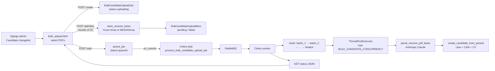
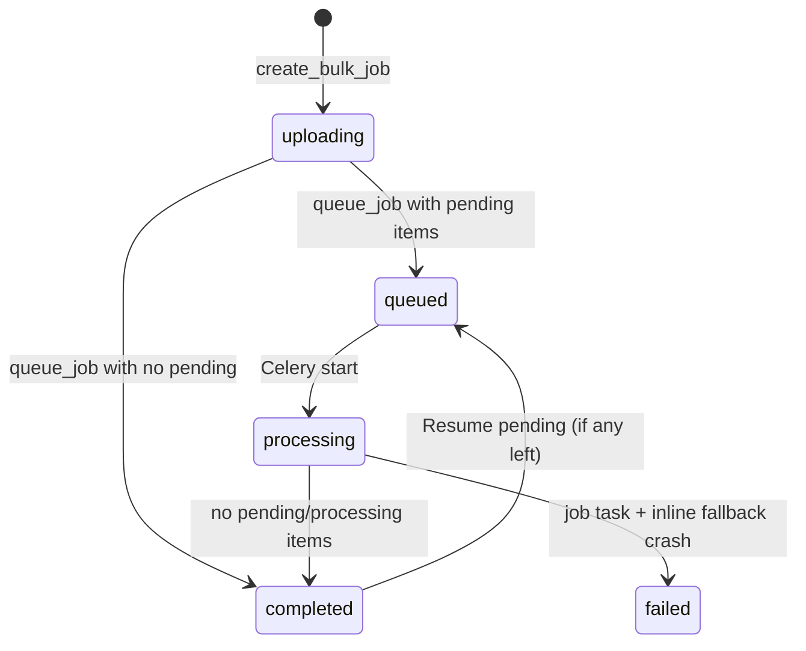

# Bulk Upload Candidates

This document describes the **current** admin bulk candidate import in this repository. It is written from the Django admin UI, models, Celery tasks, resume parser, and tests as they exist today — not a planned or spreadsheet-based importer.

This flow is **not** the public `/get-started` onboarding wizard. Staff upload PDFs in Django admin; Celery workers parse them with Anthropic/Claude and create `User` rows with the **CAN** role.

---

## 1. Overview

### What it is

A Django admin tool that:

1. Accepts many **PDF resumes** in one job (default cap **1000**).
2. Stores each file (Azure temp blob, or local `MEDIA/temp` if Azure is unavailable).
3. Queues a Celery job.
4. Processes resumes **in batches of 20** (configurable). Inside a batch, up to **5** resumes parse/import **in parallel** (thread pool).
5. Creates a candidate (`accounts.User` + CAN role) per successful parse, or marks the item **duplicate** / **failed**.
6. Shows live progress in admin (poll every 2.5s).

### Why it exists

Ops/admin need to ingest large resume sets without filling the Candidate add form one-by-one. Parsing reuses `backend/src/backend/accounts/resume_parse.py` (same Claude extractor used conceptually for onboarding; bulk is the **wired** HTTP/admin caller).

### Who can use it

- Django admin, **Candidate** changelist → **Bulk Upload Candidates**.
- Every bulk HTTP handler calls `_require_add` → `CandidateAdmin.has_add_permission(request)` (`backend/src/backend/accounts/admin_bulk_upload.py`). `CandidateAdmin` does not override this; Django’s default **add** permission on the Candidate proxy applies. Views are also wrapped with `admin_site.admin_view` (staff + CSRF).
- Recent-job list on the page is filtered to `created_by=request.user`. Status by `job_id` is any job the staff user can open (no extra owner check beyond add permission + knowing the id).

### What it is not

- Not Excel/CSV candidate import.
- Not a public REST endpoint (`accounts/parse_resume/` is **not** this pipeline).
- Does **not** send a verification email (created users are `is_verified=True`).
- Does **not** set `onboarding_completed=True` (it is `False`).
- Does **not** persist parsed **education** (there is no `education` field on `User`).
- Does **not** invent catalog skills; names are matched to existing `web_app.Skills`.

---

## 2. Architecture

### High-level



### Process / data plane

| Layer | Component | Role |
|-------|-----------|------|
| Browser | `admin/accounts/candidate/bulk_upload.html` | Select PDFs, chunked upload, poll progress |
| HTTP (Django web) | `admin_bulk_upload.py` | Create job, accept files, start, status JSON |
| ORM | `BulkCandidateUploadJob` / `Item` | Durable progress; survives refresh |
| Object storage | Azure blob **or** `MEDIA_ROOT/temp` | PDF bytes until import |
| Queue | RabbitMQ (`CELERY_BROKER_URL`) | Async job fan-out |
| Worker | `celery -A backend worker` | Parse + DB writes (not the gunicorn process) |
| LLM | Anthropic Messages API | Extract JSON profile from PDF/text |
| Postgres | `accounts_user`, M2M skills/work | Candidate records |

Local Docker (`backend/docker-compose.yml`): **web** (gunicorn) and **worker** (Celery `--concurrency=4 --prefetch-multiplier=1`) share the same image/env; **broker** is RabbitMQ. Uploads hit **web**; parsing must run on **worker** (or the start call returns 503 if enqueue fails).

### Control plane vs data plane

```text
Control plane (request/response, short)
  Admin UI  →  create / add-files / start / status
  add-files stores PDFs and INSERT items (can be slow for large chunks, but no Claude)

Data plane (background, long)
  Celery chain  →  process_batch (threads)  →  Anthropic + User.create
  Status JSON is read-only over items (no N+1 on candidate beyond select_related)
```

### Batching vs parallelism (actual policy)

This is **not** “1000 parallel Claude calls.”

```text
Job of N PDFs (N ≤ BULK_CANDIDATE_MAX_FILES, default 1000)
        │
        ▼
Split into batches of BULK_CANDIDATE_BATCH_SIZE (default 20)
  item index 0–19  → batch_number 1
  item index 20–39 → batch_number 2
  …
        │
        ▼
Celery chain (production):  process batch 1  THEN  batch 2  THEN  …  THEN  finalize
        │
        ▼
Inside one batch: ThreadPoolExecutor
  workers = min(BULK_CANDIDATE_CONCURRENCY, batch length)
  default concurrency 5, capped by batch size
        │
        ▼
Each worker: one Anthropic parse + one candidate insert
        │
        ▼
Optional sleep BULK_CANDIDATE_ITEM_DELAY_SECONDS (default 0.5s)
  between batches only — not between resumes inside a batch
```

Example: **1000 PDFs**, defaults → **50 batches** of 20. At most **5** in-flight Claude calls at a time. After a batch finishes, 0.5s pause, then the next batch.

`process_job()` in `bulk_upload.py` is the **inline** equivalent (eager tests, or Celery chain failure fallback). Production enqueue uses `process_bulk_candidate_upload_job` which builds `celery.chain(batch…, finalize)`.

### Why threads inside a Celery task

- Claude HTTP is **I/O-bound**; a process-per-resume would multiply PDF memory.
- `CELERY_WORKER_PREFETCH_MULTIPLIER=1` and worker `--concurrency=4` isolate **jobs**, not resumes.
- `LookupCache` is warmed once per batch (roles, locations, job functions, skills) and shared read-only across threads so 20 items do not each query the catalog.
- `process_item` never raises to the pool; one resume failure does not abort the batch (`tests.py`: one imported, one duplicate, one failed → job **completed**).

### Idempotency and crashes

- Item lock: `select_for_update` on the item; skip if already terminal or already has `candidate_id`.
- Stuck **processing** items older than `BULK_CANDIDATE_STUCK_SECONDS` (default 900s) are reset to **pending** (`reclaim_stuck_items`) when a job starts or finalizes.
- Celery: `CELERY_TASK_ACKS_LATE=True`, `CELERY_TASK_REJECT_ON_WORKER_LOST=True`. Batch task `max_retries=2`, `default_retry_delay=30`.
- Duplicate detection: `User.email` case-insensitive **before** create; `IntegrityError` is **Duplicate** only if that email already exists, otherwise **Failed** with “not an email duplicate”.

---

## 3. Admin user flow

Entry: Candidate changelist object tools → **Bulk Upload Candidates**  
(`frontend` is not involved. Template: `backend/src/backend/accounts/templates/admin/accounts/candidate/change_list.html`.)

Page: `/admin/accounts/candidate/bulk-upload/`  
Job page: `/admin/accounts/candidate/bulk-upload/<job_id>/`

```text
Select PDFs (drag/drop or file picker)
        ↓
Start Bulk Processing
        ↓
POST create  →  job id
        ↓
POST add-files in chunks of batch_size (FormData field "resumes")
        ↓
POST start  →  Celery
        ↓
Poll GET status every 2500ms
        ↓
Job completed / failed
        ↓
View Candidates table  or  Upload another batch
```

Client-side (template JS):

- Only `.pdf` names; size `> RESUME_MAX_UPLOAD_MB` skipped in the browser.
- Cap `MAX_FILES` in the picker; extras not added to the selection list.
- Upload chunks equal `batch_size` (same 20 as processing batches — coincidence of using `CHUNK = batch_size` for HTTP too).
- History `replaceState` to the job page URL so refresh keeps progress.
- **Resume pending resumes** appears when `pending > 0` and job is not `processing`/`queued`; it POSTs `start` again.

---

## 4. HTTP API (admin-only)

Registered in `CandidateAdmin.get_urls()` (`backend/src/backend/accounts/admin.py`).

| Name | Method | Path | Handler |
|------|--------|------|---------|
| `admin:accounts_candidate_bulk_upload` | GET | `…/candidate/bulk-upload/` | Page (no job) |
| `admin:accounts_candidate_bulk_upload_job` | GET | `…/candidate/bulk-upload/<job_id>/` | Same template + payload |
| `admin:accounts_candidate_bulk_upload_create` | POST | `…/candidate/bulk-upload/create/` | `{ ok, job_id, urls }` |
| `admin:accounts_candidate_bulk_upload_add_files` | POST | `…/candidate/bulk-upload/<job_id>/add-files/` | multipart `resumes` or `resumes[]` |
| `admin:accounts_candidate_bulk_upload_start` | POST | `…/candidate/bulk-upload/<job_id>/start/` | Enqueue Celery |
| `admin:accounts_candidate_bulk_upload_status` | GET | `…/candidate/bulk-upload/<job_id>/status/` | Progress JSON |

CSRF: `X-CSRFToken` on fetch.

**Create** — `create_bulk_job(request.user)` → status `uploading`.

**Add files** — `add_files_to_job`. Job must be `pending` or `uploading`. Over max files: remaining files returned as `status: rejected` (no DB row). Invalid PDF: item created as **failed**. Success: **pending** + `stored_name`.

**Start** — `queue_job`: requires at least one item; if nothing **pending**, just `finalize_job`. Else status `queued`, then `transaction.on_commit(process_bulk_candidate_upload_job.delay)`. Enqueue errors → **503** with a Celery/RabbitMQ message.

**Status** — `job_status_payload(job)`: counts, per-batch stats, per-item filename/status/error/extracted name/email/`candidate_id`.

---

## 5. Models

`backend/src/backend/accounts/models.py` (migration `0016_bulk_candidate_upload.py`). Both inherit `TimeStampedModel` (`created_at`, `modified_at`, `created_by`).

### `BulkCandidateUploadJob`

| Field | Meaning |
|-------|---------|
| `status` | `pending`, `uploading`, `queued`, `processing`, `completed`, `failed` |
| `total_files` | Item count (updated on add / finalize) |
| `started_at` / `finished_at` | Processing window |
| `created_by` | Admin who created the job |

`create_bulk_job` sets **uploading**, not the model default `pending`.

Job **failed** is set only if the Celery entry task’s inline fallback also crashes (`tasks.py`). Per-resume failures do **not** fail the job; the job still **completes**.

### `BulkCandidateUploadItem`

| Field | Meaning |
|-------|---------|
| `job` | FK, cascade delete |
| `batch_number` | 1-based; `(index // batch_size) + 1` at insert time |
| `original_filename` | Uploaded name (max 255) |
| `stored_name` | Temp object key from `store_resume_bytes` |
| `status` | `pending`, `processing`, `imported`, `duplicate`, `failed` |
| `error_message` | Truncated to 2000 chars on write |
| `extracted_name` / `extracted_email` | From parser, for the UI table |
| `candidate` | FK to created `User`, `SET_NULL` on user delete |

Indexes: `(job, status)`, `(job, batch_number)`.

---

## 6. File validation and storage

### Validation (`validate_resume_upload`)

- Filename must end with `.pdf`.
- `content_type` if present must be PDF-like or `application/octet-stream` / `binary/octet-stream` / empty.
- Size 0 rejected; size over `RESUME_MAX_UPLOAD_MB` (default **5**) rejected.
- First 8 bytes must start with `%PDF`.

Parser also enforces max bytes on the loaded payload.

### Storage (`resume_parse.store_resume_bytes`)

1. Sanitize name, prefix random 6 digits, path `temp/{file_name}`.
2. Try Azure upload (`upload_azure_blob`, `is_temp=True`).
3. On failure: write `MEDIA_ROOT/temp/{file_name}`.
4. Return **basename** (`stored_name`), not the `temp/` prefix.

Load (`load_resume_bytes`): Azure `temp/{name}` then raw key, then local `media/temp/`.

After a successful User insert, CV is promoted:

1. `move_file_from_temp_bucket('temp/' + stored_name, 'candidate_images/{user_id}/{stored_name}')`.
2. If that fails: copy `media/temp/` → `media/candidate_images/{id}/`.
3. Else keep `temp/{stored_name}` so admin View CV can resolve it.

---

## 7. Resume parsing (LLM)

`backend/src/backend/accounts/resume_parse.py` — `parse_resume_pdf_bytes`.

1. Require `ANTHROPIC_API_KEY` (placeholder strings rejected).
2. Extract text with **pypdf** (first 40 pages). If ≥ 40 characters, send **text** to Claude.
3. Else send the PDF as a **base64 document** (`anthropic-beta: pdfs-2024-09-25`).
4. Model default `claude-sonnet-4-20250514` (`CLAUDE_RESUME_MODEL`). Timeout default **90s**.
5. HTTP 429/500/502/503/529 → `TemporaryParseError` (retryable). Other failures → `ValueError`.

Normalized fields: name, email, mobile, linkedin, bio, location (string), gender, current/expected CTC (LPA), job_function (string), experience_yrs/month, skills `[{name}]`, education[], work_experience[].

**Bulk retries** (`_parse_with_retry`): up to `BULK_CANDIDATE_PARSE_MAX_RETRIES` (default 3). Temporary errors sleep `Retry-After` or exponential backoff capped at 30s. Non-retryable: “not configured”, “too large”, “empty resume”.

PDF bytes are dropped (`pdf_bytes = None`) after parse to free memory before create/Azure move.

---

## 8. Candidate create mapping

`create_candidate_from_parsed` (`bulk_upload.py`).

### Required

- **Email** — else `MissingFieldsError` → item **failed** (“Could not extract an email address…”).
- Role **CAN** must exist (`Roles.code_name='CAN'`, typically `accounts/fixtures/roles.json`). Else `ValueError`.

### Duplicate

Existing `User` with `email__iexact` → `DuplicateCandidateError` → item **duplicate**. No second user.

### Created `User` fields (actual)

| Set | Value |
|-----|--------|
| `name` | Parsed, or filename stem, or `"Unknown"` (max 128) |
| `email` | Normalized |
| `mobile` | Optional |
| `gender` | Only `male` / `female` / `other` |
| `experience_yrs` / `experience_month` | From parser |
| `bio` | Truncated 50000 |
| `linkedin` | http(s) URL, length ≤ 200 |
| `current_ctc` / `expected_ctc` | From parser |
| `location` | Matched `web_app.Location` (exact then substring) |
| `job_function` | Matched `JobFunction`, or inferred from first matched skill that has a function |
| `skill_ratings` | `[]` (levels not stored on bulk import) |
| `professional_links` | `[]` |
| `remote_only` | `False` |
| `onboarding_completed` | **`False`** |
| `is_verified` | **`True`** |
| `is_active` | `True` |
| `is_staff` | `False` |
| `date_joined` | Today |
| `created_by` | Job’s `created_by` |
| password | **unusable** (`set_unusable_password`) |
| `role` | CAN |
| `skills` M2M | Catalog skills whose **name** matches (exact then case-insensitive). Unmatched names dropped. |
| `work_experience` | New `WorkDetails` rows when company or designation present |
| `cv` | Promoted path as in §6 |

**Not saved:** education rows, preferred locations, skill rating levels, `salary_type`.

---

## 9. Celery tasks

`backend/src/backend/accounts/tasks.py`

| Task | Behavior |
|------|----------|
| `process_bulk_candidate_upload_job(job_id)` | Reclaim stuck items; set job `processing`; if `CELERY_TASK_ALWAYS_EAGER` → `process_job` inline; else `chain(batch.si…, finalize.si)`; on chain error → inline `process_job`; if that fails → job `failed` |
| `process_bulk_candidate_upload_batch(job_id, batch_number)` | `process_batch`; retries 2× / 30s |
| `finalize_bulk_candidate_upload_job(job_id)` | Reclaim + `finalize_job` |

`queue_job` uses `transaction.on_commit` so the worker never runs before the `queued` row and items are committed.

Worker command (compose):  
`celery -A backend worker -l info --concurrency=4 --prefetch-multiplier=1`

---

## 10. Configuration

Defined in `backend/src/backend/settings.py`, documented in `backend/.env.example`.

| Setting | Default | Effect |
|---------|---------|--------|
| `ANTHROPIC_API_KEY` | empty | Required for parse |
| `CLAUDE_RESUME_MODEL` | `claude-sonnet-4-20250514` | Claude model id |
| `CLAUDE_PARSE_TIMEOUT_SECONDS` | 90 | HTTP timeout |
| `RESUME_MAX_UPLOAD_MB` | 5 | Per-file cap |
| `BULK_CANDIDATE_BATCH_SIZE` | 20 | Items per batch **and** admin upload chunk size |
| `BULK_CANDIDATE_MAX_FILES` | 1000 | Max items per job |
| `BULK_CANDIDATE_CONCURRENCY` | 5 | Thread pool size, capped by batch size |
| `BULK_CANDIDATE_ITEM_DELAY_SECONDS` | 0.5 | Pause **between batches** |
| `BULK_CANDIDATE_PARSE_MAX_RETRIES` | 3 | Parse attempts per resume |
| `BULK_CANDIDATE_STUCK_SECONDS` | 900 | PROCESSING → PENDING reclaim |
| `CELERY_BROKER_URL` | (required) | RabbitMQ |
| `CELERY_WORKER_PREFETCH_MULTIPLIER` | 1 | One reserved task per worker process |
| `CELERY_TASK_ACKS_LATE` | True | Ack after work |
| `CELERY_TASK_REJECT_ON_WORKER_LOST` | True | Requeue if worker dies |

`BULK_CANDIDATE_MAX_FILES` / `BATCH_SIZE` are parsed with `_config_int` (digits only) so a typo like `1000F` still becomes `1000`.

`accounts/constants.py` still has `BULK_CANDIDATE_BATCH_SIZE = 20` as a comment-level constant; **runtime** uses Django settings.

---

## 11. Item and job status



Item:

```text
pending → processing → imported
                     → duplicate
                     → failed
invalid upload  → failed (never pending)
over max        → rejected (JSON only, no row)
```

---

## 12. Error handling (actual messages)

| Situation | Result |
|-----------|--------|
| Non-PDF / not `%PDF` / empty / too large | Item **failed** at add-files |
| Job already started (`queued`+) | `ValueError`: job can no longer accept resumes |
| No files on add-files | 400 `No resume files were received.` |
| Start with zero items | 400 `Add at least one resume before starting.` |
| Celery enqueue exception | 503, ask to confirm Celery/RabbitMQ |
| Missing email after parse | **failed** |
| Email already in DB | **duplicate** |
| IntegrityError without existing email | **failed**, not duplicate |
| Anthropic temporary errors | retry then **failed** |
| Uncaught exception in `process_item` | **failed** `Unexpected error while importing this resume.` |
| Missing CAN role | **failed** (ValueError text) |

One bad resume never stops siblings in the same batch or later batches.

---

## 13. Refresh, logout, resume

- Progress is in Postgres. Refreshing the job URL reloads `job_payload` and resumes polling.
- Closing the browser does not stop the worker.
- **Resume pending resumes** re-calls `queue_job` (re-enqueue) when the job is not currently `queued`/`processing`.
- Worker crash: items left in `processing` older than 15 minutes (default) are reclaimed to `pending` on the next start/finalize.

---

## 14. Tests

`backend/src/backend/accounts/tests.py` (among others):

- Batch numbering: index 0–19 → batch 1, 20 → 2, 999 → 50 at size 20.
- PDF validation rejects docx names, non-PDF bytes, empty files.
- Over `MAX_FILES` → `rejected` results.
- Invalid PDF → failed item.
- Create + duplicate email.
- Missing email → `MissingFieldsError`.
- Mixed imported / duplicate / failed → job **completed**, one user for the shared email.
- Thread pool `max_workers` equals min(concurrency, batch length).
- IntegrityError without an existing email is **not** classified as Duplicate.

---

## 15. File map

| Path | Responsibility |
|------|----------------|
| `backend/src/backend/accounts/templates/admin/accounts/candidate/change_list.html` | Changelist button |
| `backend/src/backend/accounts/templates/admin/accounts/candidate/bulk_upload.html` | UI + JS |
| `backend/src/backend/accounts/admin.py` | URL wiring, `changelist_view` context |
| `backend/src/backend/accounts/admin_bulk_upload.py` | HTTP handlers |
| `backend/src/backend/accounts/bulk_upload.py` | Job/item logic, parse retry, candidate create, payload |
| `backend/src/backend/accounts/tasks.py` | Celery chain / batch / finalize |
| `backend/src/backend/accounts/resume_parse.py` | Claude parse + temp storage |
| `backend/src/backend/accounts/models.py` | Job/Item models |
| `backend/src/backend/accounts/services.py` | `move_file_from_temp_bucket` |
| `backend/src/backend/celery.py` | Celery app |
| `backend/docker-compose.yml` | web + worker + RabbitMQ |
| `backend/src/backend/settings.py` | Bulk / Claude / Celery settings |
| `backend/src/backend/accounts/tests.py` | Behaviour tests |

---

## 16. Operational notes

1. **Worker must be running.** Start without a worker → 503 or a job stuck in `queued`.
2. **`ANTHROPIC_API_KEY`** must be set on the **worker** environment (same `.env` in compose).
3. Keep **`BULK_CANDIDATE_CONCURRENCY` modest** (default 5). Raising it increases Claude 429s and RSS from parallel PDFs.
4. **Do not** treat `BULK_CANDIDATE_BATCH_SIZE` as the total upload cap; that is `BULK_CANDIDATE_MAX_FILES`.
5. Imported candidates are **verified** with **unusable passwords** and **incomplete onboarding**. They will not log in with a password until one is set (e.g. admin Manage User UUID). They will not get the signup verification email from this path.
6. Excel bulk endpoints mentioned in the public API description (jobs, skills, locations, etc.) are a **different** feature (`web_app` viewsets), not this PDF pipeline.
)