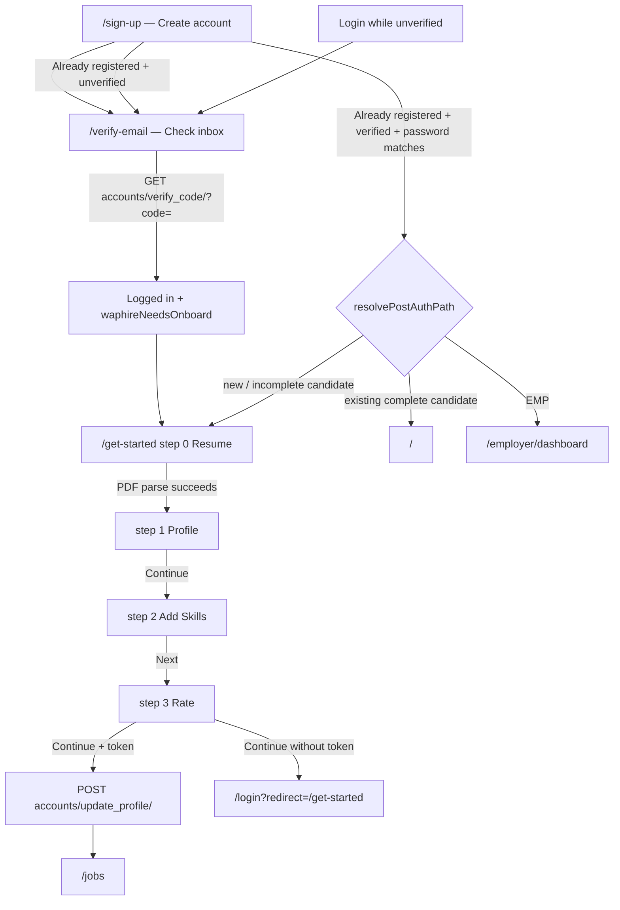
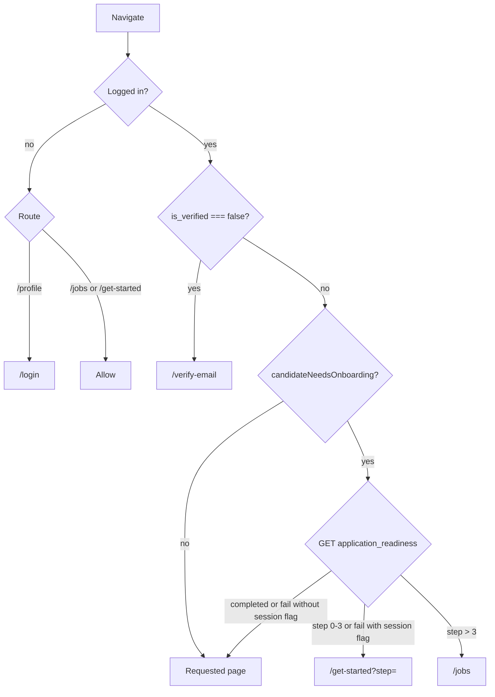

# Candidate Onboarding Flow

This document describes the **current** candidate onboarding implementation in this repository. It is based on the frontend wizard, auth gates, and Django `accounts` / `web_app` code as they exist today — not a planned or historical design.

**Primary frontend files**

| Area | Path |
|------|------|
| Signup / login UI | `frontend/components/auth/AuthPanel.tsx` |
| Email verification UI | `frontend/components/auth/VerifyEmailClient.tsx` |
| Wizard | `frontend/components/onboard/OnboardingFlow.tsx` |
| Add Skills UI | `frontend/components/onboard/AddSkillsStep.tsx` |
| Payload helpers | `frontend/components/onboard/profilePayload.ts` |
| Salary helpers | `frontend/components/onboard/salary.ts` |
| Onboarding gate helpers | `frontend/utils/onboardingGate.ts` |
| Post-auth routing | `frontend/utils/applyFlow.ts` |
| Email verification helpers | `frontend/utils/emailVerificationGate.ts` |
| API constants | `frontend/constants/api.ts` |

**Primary backend files**

| Area | Path |
|------|------|
| Auth / profile API | `backend/src/backend/accounts/viewsets.py` |
| Signup serializer | `backend/src/backend/accounts/serializers.py` |
| Login / verification email | `backend/src/backend/accounts/services.py` |
| User model | `backend/src/backend/accounts/models.py` |
| Permissions | `backend/src/backend/accounts/permissions.py` |
| Resume LLM parser (used by **admin bulk upload**, not an onboarding HTTP action in this repo) | `backend/src/backend/accounts/resume_parse.py` |
| Job functions / skills | `backend/src/backend/web_app/viewsets.py`, `backend/src/backend/web_app/models.py` |

API prefix: `waphire-api/v1` (`frontend/constants/api.ts` → `API_URL`).

---

## 1. Overview

### What onboarding is

Candidate onboarding is a **four-step client wizard** on `/get-started`. Step labels are defined in `frontend/utils/onboardingGate.ts` as:

1. **Resume**
2. **Profile**
3. **Add Skills**
4. **Rate**

(`LAST_WIZARD_STEP = 3`. Older drafts that still pointed at removed Job/Apply steps are treated as finished and sent to Jobs.)

The wizard collects a **session draft** (`sessionStorage` key `waphireOnboardDraft`) and, on the last step, POSTs `accounts/update_profile/` then treats onboarding as complete locally and navigates to `/jobs`.

### Why it exists

New candidates are expected to upload a resume, review extracted/edited profile data, pick a job function and skills, rate those skills, then enter the jobs listing. Incomplete candidates are steered away from Jobs and Profile via client gates (see §8–§9).

### Which users go through onboarding

| User | Behavior |
|------|----------|
| New email/password **candidate** (role id `2`) | Signup → verify email → full wizard |
| Candidate who signs up with an email that already exists but is **unverified** | Backend updates that user and resends verification; frontend still goes to `/verify-email` |
| Candidate who signs up with an email that **already exists and is verified** | Frontend tries login with the password just entered; if login works, continues as returning user (may mark needs-onboard if `onboarding_completed === false`) |
| **Employer** (role id `1`) | Same signup/verify email APIs. After login, `resolvePostAuthPath` sends employers to `/employer/dashboard`. Employer verification emails are generated with a different frontend URL (see §3). This document covers **candidates** only. |
| Logged-in candidate with **incomplete** onboarding (`onboarding_completed === false` **or** session flag `waphireNeedsOnboard`) | Full wizard (`mode = "onboard"`) |
| Logged-in candidate who is **not** marked incomplete | `/get-started` renders `ExpressApply` instead of the four-step wizard (`frontend/components/onboard/ExpressApply.tsx`). That is a separate apply/gap-fill flow, not the new-user wizard. |
| Guest (not logged in) | Can open `/get-started` and fill the wizard. Saving the profile on Rate requires an auth token; otherwise the user is sent to login. |

`candidateNeedsOnboarding()` (`frontend/utils/onboardingGate.ts`) returns false for employer-only accounts (`EMP` without `CAN`). It returns true when `onboarding_completed === false`. If the flag is missing, it falls back to sessionStorage `waphireNeedsOnboard`.

**Important (actual serializer vs frontend):** `UserSerializer` does **not** include `onboarding_completed` in its `fields` list (`backend/src/backend/accounts/serializers.py`). Auth responses (`login`, `verify_code`, `user_clone`) therefore typically omit the flag. After `user_clone` (header, on logged-in mount), client gating often depends on the **session marker** set at signup/verification rather than a server boolean.

### When onboarding starts

- After successful **email verification**, `VerifyEmailClient` logs the user in, sets `waphireNeedsOnboard`, and hard-redirects to `/get-started` (optionally `?job=` if an apply job was remembered).
- After **login/signup** routing in `resolvePostAuthPath` (`frontend/utils/applyFlow.ts`) when the result is treated as a new user, `intent === "signup"` with tokens, or `user.onboarding_completed === false`.
- Direct visit to `/get-started` (including guests).

### When onboarding ends

The wizard ends when Rate → **Continue** succeeds:

1. `pushProfileToAccount` POSTs `accounts/update_profile/`.
2. `goToJobsAfterWizard` calls `markOnboardingComplete()`, dispatches Redux `setOnboardingCompleted`, clears the draft, and `window.location.replace("/jobs")`.

`markOnboardingComplete()` POSTs `accounts/complete_onboarding/`. **That action is not defined on `UserViewSet` in this repository.** On failure it falls back to `POST accounts/update_profile/` with `{ onboarding_completed: true }`. **`onboarding_completed` is also not in `UserSerializer.fields`**, so that fallback is not persisted by the current serializer either. The client still clears `waphireNeedsOnboard` and sets `user.onboarding_completed = true` in Redux.

### What happens after completion

The user is sent to **`/jobs`**. Header nav to Jobs/Profile for users still flagged incomplete is intercepted and sent back to `/get-started` (see §9).

---

## 2. Complete user flow

Verified from `AuthPanel`, `VerifyEmailClient`, `OnboardingFlow`, and `onboardingGate`:

```text
Sign up (/sign-up)
        ↓
Email verification (/verify-email)
        ↓
Resume          (/get-started, step 0)
        ↓
Profile         (/get-started, step 1)
        ↓
Add Skills      (/get-started, step 2)
        ↓
Rate            (/get-started, step 3)
        ↓
POST update_profile + local complete
        ↓
Jobs            (/jobs)
```



### Step summary

| Step | Route | Purpose | Required (client) | APIs | Next |
|------|--------|---------|-------------------|------|------|
| Signup | `/sign-up` | Create candidate account | name, mobile (`/^[6-9][0-9]{9}$/`), email, password (≥8), heard_about, role | `POST accounts/signup/` | `/verify-email?email=` |
| Verify | `/verify-email` | Confirm email via link | Query `code` from email | `GET accounts/verify_code/` | `/get-started` |
| Resume | `/get-started` step `0` | Upload PDF, parse into draft | PDF, ≤5MB | `POST accounts/parse_resume/` (frontend call; **no matching `@action` on `UserViewSet` in this repo**) | step `1` |
| Profile | step `1` | Edit personal / location / pay / experience / education | **Full name** only | None at this step (draft only) | step `2` |
| Add Skills | step `2` | Career type, job function, skills | candidate type, job function, ≥1 skill; freshers also need opportunity type | `GET settings/job_functions/`, `GET settings/skills/` | step `3` |
| Rate | step `3` | Beginner / Intermediate / Advanced | None beyond names already collected (empty list allowed) | `POST accounts/update_profile/` then complete helpers | `/jobs` |

Failure behavior is documented per step below.

---

## 3. Signup → email verification

### How a new candidate signs up

- Route: `/sign-up` → `frontend/app/sign-up/page.tsx` → `AuthPanel` with `initialMode="signup"`.
- Role default: candidate (`role = 2`). Query `?role=1` preselects employer, `?role=2` candidate (`AuthPanel.tsx`).
- Continue submits `onSignup`.

**Client payload** (`AuthPanel.onSignup`):

```ts
{
  name, mobile, email, password,
  role: [Number(values.role)],  // 1 employer, 2 candidate
  heard_about: values.heard_about,
}
```

`heard_about` is **required in the form**. `SignupSerializer` fields are only `name`, `mobile`, `email`, `role`, `password` — **`heard_about` is not saved**.

Before the request, the same payload is stored in sessionStorage as `waphirePendingVerificationSignup` (`frontend/utils/pendingVerification.ts`) so Resend can retry.

**Backend** `POST accounts/signup/` (`UserViewSet.signup`):

- Role is required and normalized to a list of ints.
- If an **active + verified** user already has that email → `400` `{ detail: "User already exists", email: "You are already registered with this role" }`.
- `SignupSerializer`:
  - Password min length **8**.
  - If an **unverified** user with that email exists: deactivate old `UserEmailVerification` rows, delete OTPs, update name/mobile/password/roles, return that user.
  - Else `User.objects.create_user(..., is_active=True)` (manager default `is_active` would be false; signup overrides it).
  - New users start with `is_verified=False` (model default) and `onboarding_completed=False` (model default).
- Then `send_verification_email(user, request)`.
- Response: `201` `{ detail: "We have sent an email to verify your account", updated: False }`.
- **No JWT is returned.** The candidate is not logged in yet.

**Frontend after Continue:** toast with `result.detail` (or a default “verify your email” string), then `window.location.assign(verifyEmailPath(email))` → `/verify-email?email=...`.

**Already registered (verified) candidate:** frontend catches `400` whose detail/email looks like “already”, then `POST accounts/login/` with that email/password. On success: `markNeedsOnboard()`, toast “Welcome back…”, `finishAuth` with `new_user` derived from `onboarding_completed === false`. On login error mentioning verify email → `/verify-email`. Otherwise “already registered, please Sign in”.

**Login while unverified:** `auth_login` returns `400` `{ detail: "Please check your email and verify your account." }`. `AuthPanel.onLogin` detects “verify your account/email” and redirects to `/verify-email`.

### What happens after clicking Continue

1. Pending signup saved in sessionStorage.
2. `POST accounts/signup/` (global error toasts suppressed).
3. Success → `/verify-email?email=...` (not logged in).
4. User is told to open the email.

They **cannot** complete Rate-save without later logging in (token required). They **can** open `/get-started` as a guest and fill the wizard (see §9).

### How the verification email is generated

`backend/src/backend/accounts/services.py`:

1. `create_email_verification_url(user)`:
   - `TimestampSigner().sign(user.id)` → `code` string.
   - Inserts `UserEmailVerification(user=user, code=code)` (`is_active=True` by default).
   - Builds a frontend URL from `settings.DOMAIN` / `DOMAIN` env:
     - Role `EMP` → `{DOMAIN}/employer/company-info/?code={code}`
     - Role `CAN` → `{DOMAIN}/profile/?code={code}`
     - Else → `{DOMAIN}/profile?code={code}`
2. `send_verification_email` sends a **plain-text** message in a background thread:  
   `Click the link to verify your email: {verify_url}`  
   Subject: `Verify your email`.

The signer is **not** checked with `unsign`/`max_age` on verify. Validity is the `UserEmailVerification` row with `is_active=True`. Re-signup deactivates previous codes for that user.

### Verification token / link flow

1. Email points candidates at **`/profile/?code=`**.
2. `ProtectedReduxWrapper` and `ProfileClient` immediately `window.location.replace('/verify-email?code=...')` so Profile does not render.
3. `/verify-email` (`VerifyEmailClient`) reads `code` and `email` from the query string.

### Verification page

`frontend/app/verify-email/page.tsx` → `VerifyEmailClient`.

- If `code` is present: spinner “Verifying your email”.
- If not: “Check your inbox / Verify your email” and shows the `email` query param. Resend UI exists in code; the email input is commented out — resend only runs if `email` is already in the query.

### What happens when the user clicks the email link

`VerifyEmailClient` (once per mount):

```ts
GET accounts/verify_code/?code=<code>
```

On success:

1. `loginUserAuthAction` stores JWT in lockr (`AUTH_TOKEN` / `REFRESH_TOKEN`) and Redux.
2. `new_user` is set to `result.new_user` if present, else `result.user.onboarding_completed === false`.
3. `clearPendingVerificationSignup()`.
4. `markNeedsOnboard()` (`waphireNeedsOnboard=1`).
5. **Hard redirect** `getStartedPath(rememberedJobId)` → `/get-started` or `/get-started?job=`.

This page does **not** call `resolvePostAuthPath` (so it always goes to get-started, not employer dashboard).

### How the backend verifies the token

`GET accounts/verify_code/` (`AllowAny`):

- Missing `code` → `400` `{ detail: "Code is required" }`.
- Lookup `UserEmailVerification` where `code=code` and `is_active=True`.
- Not found → `400` `{ detail: "Invalid code" }`.
- Else: set verification `is_active=False`, set `user.is_verified=True`, return `generate_auth_data` (`refresh`, `access`, `user` via `UserSerializer`).

There is **no expiry timestamp check** in this action. Used codes cannot be reused (`is_active=False`).

### Invalid / expired link

Backend only distinguishes **missing** vs **invalid** (inactive or unknown) codes. The frontend error copy says “Invalid or expired verification link.”

Resend (`POST accounts/resend_verification/`):

- **Not implemented** on `UserViewSet`. A POST to that path is treated like a detail URL and typically **401**.
- Frontend catch: if status is 401/403/404 **and** session still has the same-email pending signup, it **re-POSTs `accounts/signup/`** with that payload (which sends a new email and invalidates old codes).
- Cooldown 30s after a send that is not `already_verified`.
- If resend fails with 401 and no pending payload: “Please sign up again with the same email…”.

### Accessing onboarding before verification

| Situation | Behavior |
|-----------|----------|
| After signup, not logged in | `/get-started` is reachable; wizard runs in guest `onboard` mode. Rate-save redirects to login. |
| Logged in with `user.is_verified === false` | `OnboardingFlow` `router.replace`s to `/verify-email?email=`. Same check on Jobs/Profile gates. |
| Login API | Rejects unverified users until they verify. |

### Redirect after successful verification

Always `/get-started` (plus `?job=` if `waphireApplyJob` was stored). Then the wizard starts at Resume (or a restored step — §8).

### Google sign-up (current mismatch)

`AuthPanel` can show Google (`SHOW_GOOGLE_SIGNIN = true`). Frontend `GoogleLogin` POSTs `{ token: access_token, fcm_token }` to `accounts/google_login/`. Backend `google_login` expects `{ code, redirect_uri }`, exchanges them with Google, `get_or_create`s a user by email, and returns `{ detail, new_user, email, name }` — **no JWT**. Treat Google as **not a working substitute** for the email/password + verify_code path unless another layer exists outside this repo.

---

## 4. Resume step

### Page

- Route: `/get-started` (`frontend/app/get-started/page.tsx`).
- Server loader `fetchOnboardingPageData` (`frontend/utils/serverJobData.ts`) prefetches locations, a jobs list, and optional `?job=` job.
- Client: `OnboardingFlow`, `step === 0`.
- Hero copy: “Upload your resume” / “PDF only…”.
- Drop zone: click or drag-and-drop. CTA “Choose PDF”. Hints: “1 Upload PDF / 2 Confirm profile / 3 Apply in minutes”.
- If the draft already has `cvFileName` or `cvDisplayName` and parsing is idle, a **Continue** button appears (skip re-upload).

There is **no skip-without-file** control on first visit. The stepper only allows jumping to steps `<= current step`.

### Accepted file types

Frontend: `accept="application/pdf"` and `file.type !== "application/pdf"` → “Please upload a PDF resume.”

### File-size validation

Frontend: `file.size > 5 * 1024 * 1024` → “Resume must be under 5MB.”

`resume_parse.py` `_max_resume_bytes()` is used by **bulk upload**, not by a public onboarding parse action in `viewsets.py`.

### Resume upload API (what the wizard calls)

```ts
POST accounts/parse_resume/
FormData: file
timeout: 120000
auth: none  (postFormDataWithoutToken)
```

Constants: `PARSE_RESUME` in `frontend/constants/api.ts`.

**This repository’s `UserViewSet` does not define `parse_resume`.** `UserPermissions` has no `parse_resume_perms`. A POST to `accounts/parse_resume/` is not a registered list action.

On 401/403 the UI shows “Resume upload is temporarily blocked. Please refresh and try again.”  
On 502/503/504 or no response: “Resume service is unavailable…”  
Other errors: `detail` or “Could not analyze this resume.”

### Resume storage / parsing (code that exists, not wired as this HTTP action)

`backend/src/backend/accounts/resume_parse.py`:

- `parse_resume_pdf_bytes`: Anthropic (`ANTHROPIC_API_KEY`, `CLAUDE_RESUME_MODEL`, default `claude-sonnet-4-20250514`). Prefers extracted PDF text; falls back to Claude PDF document content.
- `store_resume_bytes`: Azure temp blob `temp/{random}_{filename}`, else `MEDIA_ROOT/temp/`.
- **Callers in this repo:** admin bulk candidate upload (`bulk_upload.py`), not `UserViewSet`.

Normalized parse shape (`_normalize_parsed`): `name`, `email`, `mobile`, `linkedin`, `bio`, `location` (string), `gender`, `current_ctc`, `expected_ctc`, `job_function` (string), `experience_yrs`, `experience_month`, `skills[]`, `education[]`, `work_experience[]`.

### Extracted data used by the wizard

`mergeParsed` in `OnboardingFlow.tsx` fills empty draft fields only:

- `name`, `email`, `mobile`, `linkedin`, `bio`
- `experience_yrs` / `experience_month` (forced to 0 if `candidate_type === "fresher"`)
- `work_experience` if the draft has no company/designation yet
- `education` if the draft has no institution/degree yet
- `resumeSkills`: unique skill names from the parse (**suggestions only, never auto-selected**)
- `cvFileName`: `parsed.file_name || parsed.cv`
- `cvDisplayName`: original file name

`gender`, parsed `location` string, and parsed `job_function` **string** are **not** applied on this merge. CTC from parse is **not** copied into the draft here.

Legacy drafts that stored parsed skills in `skills` without `resumeSkills` are migrated: those names become suggestions and `skills` is cleared.

### Master Resume / max resume count

**Not implemented in the new-user wizard.** One PDF is kept on the draft (`cvFileName` / `cvDisplayName`).

A **3-resume** cap (`MAX_RESUMES` / `MAX_CANDIDATE_RESUMES = 3`) exists on **Express Apply** and **Profile**, which also call `APPLICATION_READINESS` for a `resumes[]` list. That is not the four-step onboarding path.

### Success / error / next

On parse success: toast “Resume analyzed. Review and edit your details.” → `setStep(1)`.

Replace: Profile step shows a file chip with **Replace** → back to step 0.

---

## 5. Profile step

### Page

`OnboardingFlow` `step === 1`. Stepper label: **Profile**. Hero title in code is “What kind of opportunity are you looking for?” (the career-type control actually lives on Add Skills).

Data is written only to the **session draft** on Continue. **No API** until Rate.

### Fields that exist on this step

| UI field | Form name | Required | Notes |
|----------|-----------|----------|--------|
| Full name | `name` | Yes | Ant Design `required` |
| Mobile | `mobile` | No | Placeholder `+91…` |
| LinkedIn | `linkedin` | No | Normalized with `toLinkedinUrl` on save (scheme added if missing; dropped if invalid or length > 200) |
| About you | `bio` | No | Textarea |
| Years of experience | `experience_yrs` | No | 0–50 |
| Additional months | `experience_month` | No | 0–11 |
| Current city | `location` | No | `Select` from `GET settings/locations` (`useLocations.ts`, `page_size: 200`) |
| Open to working | `preferred_locations` | No | Multi-select, `maxCount` = `MAX_PREFERRED_LOCATIONS` (**3**) in `frontend/constants/profile.ts` |
| Open to remote | `remote_only` | No | Checkbox |
| Compensation unit | local `compUnit` | — | Yearly (LPA) vs Monthly (₹); default yearly |
| Current / expected CTC | `current_ctc`, `expected_ctc` | No | Shown when `candidate_type !== "fresher"` |
| Expected compensation | `expected_salary_monthly` | No | Shown when `candidate_type === "fresher"` |
| Work experience list | `work_experience` | No | company, role, start/end dates, currently working, add/remove |
| Education list | `education` | No | institution, degree, field, start/end **month** pickers, add/remove |

**Not on this wizard step (even if they exist elsewhere):**

- **Gender** — on `User.gender` and in the LLM parse schema; **no onboarding control**.
- Professional links / GitHub / photo.
- `currently_studying` checkbox — present on the draft type and mapped on save, but **not rendered** in the onboarding `Form.List`.
- Job function / career type — **Add Skills**.

On the **first** visit, `candidate_type` is still `null`, so the Profile step shows **professional CTC fields**. Fresher pay UI appears only if the user later chooses Student/Fresher on Add Skills and navigates **Back**.

Locations: `GET settings/locations` is AllowAny (`AdminWebAppPermissions.locations_perms`).

### Validation

- Name required.
- CTC / expected amounts: if filled, must be a finite number; professionals `>= 0`, fresher expected `> 0`. Empty is allowed.
- Yearly LPA inputs `max={1000}`.

`saveProfileStep`: `form.validateFields()` then persist draft and `setStep(2)`.

### Compensation persistence (draft)

- Professional: `salary` stored as LPA via `normalizeCompToLpa`; `expected_salary_monthly` null.
- Fresher: `expected_salary_monthly` as ₹/month via `normalizeCompToMonthly`; `current_ctc` / `expected_ctc` null on draft (later `expected_ctc` is also sent as LPA equivalent on profile POST).

### API / models on Continue from Profile

None. Draft only.

When the **final** POST runs (`pushProfileToAccount`), these Profile-related keys are sent (see §7). Mapping to Django:

`User` (`backend/src/backend/accounts/models.py`) includes: `name`, `mobile`, `linkedin`, `bio`, `location` (FK), `experience_yrs`, `experience_month`, `current_ctc`, `expected_ctc`, `remote_only`, `cv`, `work_experience` (M2M `WorkDetails`), `job_function`, `skills`, `additional_skills`, `skill_ratings`, `gender`, `onboarding_completed`, `professional_links`.

There is **no** `education`, `preferred_locations`, `salary_type`, `expected_salary_monthly`, or `curr_pos` field on `User` in this branch (`curr_pos` was removed in migration `0005`).

`UserSerializer.update` **persists** (among onboard-relevant keys): `name`, `mobile`, `linkedin`, `bio`, `location`, `experience_yrs`, `experience_month`, `current_ctc`, `expected_ctc`, `job_function`, `cv` (moves `temp/{file}` → `candidate_images/{user_id}/{file}`), `work_experience` (creates new `WorkDetails` rows and **replaces** the M2M).

It **does not declare** `remote_only`, `preferred_locations`, `education`, `skill_ratings`, `salary_type`, `expected_salary_monthly`, `curr_pos`, `onboarding_completed` — extra JSON keys are ignored.

`skills` on update: serializer pops `skills` (default `[]`) and `instance.skills.set(...)` filtered by **same `job_function`**. The wizard sends `skill_names` / `skill_ratings`, **not** `skills` IDs, so this path sets skills to an **empty** M2M unless something else sends IDs.

### Next-step navigation

Continue → step 2. Back → step 0.

---

## 6. Skills step

### Page

`AddSkillsStep` at `step === 2`. Hero: “Tell us about your experience.” Stepper: **Add Skills**.

### How Job Function → Primary → Secondary → Additional works

Implemented entirely in `frontend/components/onboard/AddSkillsStep.tsx` against `web_app.Skills`:

```text
JobFunction (FK on Skills)
    └── Primary skills: parent IS NULL, job_function = selected function
            └── Secondary skills: parent IN (selected primary ids)
Additional skills: search (name__icontains) or free-text add
Resume suggestions: draft.resumeSkills, excluding names already selected or already shown as primary
```

Backend models (`backend/src/backend/web_app/models.py`):

- `JobFunction`: `name`, `is_active`.
- `Skills`: `name`, `job_function` FK, `parent` self-FK (`sub_skills`), `is_active`.

Filters (`backend/src/backend/web_app/filters.py`):

- `is_parent=true` → `parent__isnull=True`.
- `parent=1,2,3` → `parent_id__in=[...]`.
- `job_function`, `name__icontains`, `is_active`.

### User actions

1. **Career journey** (required): Working professional vs Student / Fresher.  
   - Professional: sets `experience_yrs` to existing or `1`; clears `fresher_looking_for`.  
   - Fresher: `experience_yrs/month = 0`; default `fresher_looking_for = "both"`.
2. Professional only: **years of experience** (hint: don’t include internships).
3. Fresher only: **Both internships and full-time** / **Full-time only** / **Internships only**. Stored on the draft as `fresher_looking_for`. **Not sent as its own API field.** Fresher vs professional is later mapped to `salary_type` (`fresher_monthly` vs `ctc`) on the final POST.
4. **Job function** `Select` (required). On change: `job_function`, `job_function_name`, `curr_pos` (same name string).
5. After a function is chosen: **primary skills** dropdown + chip suggestions. Selecting one `addSkill`s it (`parentId: null`, default `level: "beginner"`).
6. After at least one **selected skill matches a primary** for that function: **secondary skills** load with `parent=<comma-separated primary ids>`.
7. **Additional skills**: typeahead (≥2 chars, 280ms debounce) `GET settings/skills/?name__icontains=&is_active=true&page_size=30` and optional `job_function`. Enter/Add uses the first hit or **creates a free-text skill** with no id.
8. **Suggested from your resume**: chips from `resumeSkills`.
9. Selected skills render as chips; click removes (`removeSkill`). Duplicate names toast “Skill already added.” Cap **20** (`MAX_SKILLS`).

All selected skills live in **one** `draft.skills[]` (`{ id?, name, parentId?, level }`). There is no separate primary/secondary/additional array in the draft.

### APIs

| Call | Params |
|------|--------|
| `GET settings/job_functions/` | `page_size=100`, `is_active=true` |
| `GET settings/skills/` (primary) | `job_function`, `is_parent=true`, `is_active=true`, `pagination=false` |
| `GET settings/skills/` (secondary) | `parent=<ids>`, `is_active=true`, `pagination=false` |
| `GET settings/skills/` (search) | `name__icontains`, `is_active=true`, `page_size=30`, optional `job_function` |

No auth (`getWithoutTokenAPI`). Permissions: `job_functions_perms` / `skills_perms` = AllowAny. Failures show retry UI; they do not block the whole page.

### Validation (`validateAddSkills`)

- Must choose professional or fresher.
- Fresher must choose `fresher_looking_for`.
- Must choose `job_function`.
- At least one skill with a non-empty name.

Errors are toasts; Next does not advance.

### Save / update

On Next, `OnboardingFlow` persists:

- Fresher experience forced to 0.
- `skills` trimmed, max 20.
- Then `setStep(3)`.

Nothing is POSTed to the account until Rate.

Back → step 1.

---

## 7. Rate skills step

### Page

`step === 3`. Stepper: **Rate**. Hero: “Showcase your strengths.”

Lists `draft.skills`. If empty: “No skills added yet” + instruction to go back. User can still **Continue**.

Each row:

- Editable name `Input`.
- Proficiency radios: **Beginner** (“Building a foundation”), **Intermediate** (“Comfortable using it independently”), **Advanced** (“Strong practical expertise”).
- Default if unset: **beginner** (`DEFAULT_SKILL_LEVEL`).
- Remove; **Add skill** appends `{ name: "", level: "beginner" }`.

Ratings are stored only on the draft until Continue.

### Validation

No check that every skill has a level (defaults apply). Empty names are dropped on Continue.

### API calls and payload

`continueAfterRate`:

1. Sync Redux tokens to lockr.
2. If no auth token → toast “Please sign in…” → `/login?redirect=` get-started (job id preserved).
3. `pushProfileToAccount` → `POST accounts/update_profile/` (`PROFILE_UPDATE`).
4. `goToJobsAfterWizard` (complete + `/jobs`).

Payload built in `pushProfileToAccount`:

```ts
{
  name, mobile, linkedin, bio,
  location, preferred_locations, remote_only,
  experience_yrs, experience_month,
  work_experience: [{ company_name, designation, start_date, end_date, currently_working }],
  education: [{ institution, degree, field, start_date, end_date, currently_studying }],
  skill_ratings: [{ name, level }],  // sanitizeSkillRatings
  skill_names: string[],
  cv?: filename without leading "temp/",
  job_function?, curr_pos?,
  // professional:
  salary_type: "ctc", current_ctc, expected_ctc, expected_salary_monthly: null,
  // fresher:
  salary_type: "fresher_monthly", expected_salary_monthly, expected_ctc: monthlyToLpa(...), current_ctc: null,
}
```

`update_profile`: authenticated, strips `email`, `UserSerializer(..., partial=True)`. Success `{ detail: "Profile updated successfully." }`. Network/no-response: “Could not save your profile. Please try again.” Other HTTP errors use the global handler.

What actually lands in the DB is limited to **serializer fields** (see §5). `skill_ratings` is a JSONField on `User` but **not** on the serializer, so ratings from this POST are not written by the current `UserSerializer`.

### After completing the step

`goToJobsAfterWizard`:

- Logged in: `markOnboardingComplete()` then Redux `setOnboardingCompleted`.
- Guest: only `clearNeedsOnboard()`.
- Always: remove `waphireOnboardDraft`, `window.location.replace("/jobs")`.

`JOBS_AFTER_ONBOARDING = "/jobs"`.

---

## 8. Onboarding state and progress

### How completion is tracked (client)

| Store | Key / field | Role |
|-------|-------------|------|
| Redux + redux-persist (`localStorage` key `persist:root`) | `auth.user.onboarding_completed` | Set true by `setOnboardingCompleted`. Overwritten when `user_clone` / login replaces `user` from `UserSerializer` (flag usually **absent**). |
| sessionStorage | `waphireNeedsOnboard` = `"1"` | Set at signup/verify/incomplete routing. Cleared on complete or when progress fetch says completed. Fallback for `candidateNeedsOnboarding`. |
| sessionStorage | `waphireOnboardDraft` | Wizard draft + `step` + `stepsVersion: 3`. |
| sessionStorage | `waphireApplyJob` | Optional job remembered through auth. |
| sessionStorage | `waphirePendingVerificationSignup` | Signup body for resend-via-re-signup. |
| lockr / localStorage | `AUTH_TOKEN`, `REFRESH_TOKEN` | JWT. |

### Server fields

- `User.onboarding_completed` boolean, default `False` (`models.py`, migration `0017`).
- Frontend **expects** `GET accounts/application_readiness/` to return `onboarding_completed` and `onboarding_step` (`fetchOnboardingProgress`).
- **`application_readiness` and `complete_onboarding` are not `@action`s on `UserViewSet` in this repo.**

`fetchOnboardingProgress`: on success, if completed → `clearNeedsOnboard()`, else `markNeedsOnboard()`. On failure, `getMandatoryOnboardingRedirect` uses `needsOnboard()` only.

`OnboardingFlow` (logged in, no `?step=`): if progress `onboarding_completed`, it does not override step from the API. If `onboarding_step > 3`, it finishes to Jobs. If `0–3`, it sets that step.

### Wizard step vs “profile completion %”

The **wizard** does not compute a percentage. It stores an integer `step` (0–3) in the draft and optionally reads `onboarding_step` from readiness.

**Profile completion %** lives on the **Profile page** (`frontend/components/profile/ProfileClient.tsx`), not on `/get-started`.

Equal-weight checklist (`getProfileCompletionChecks`):

1. Name  
2. Mobile  
3. Email  
4. Current location  
5. Work preferences (`preferred_locations` length or `remote_only`)  
6. Job function  
7. Primary skills (`skills` array length)  
8. Additional skills (`additional_skills` array length)  
9. Education (meaningful institution/degree)  
10. Experience (work row **or** `experience_yrs` / `experience_month` present — `0` counts)  
11. Resume (`cv`, upload, or `candidateResumes`)

```ts
completionPct = round(doneCount / 11 * 100)
```

Intentionally **excluded**: gender, LinkedIn / professional links, CTC, bio, photo. Secondary skills are not a separate check (they share `skills`).

Profile also GETs `APPLICATION_READINESS` to fill `candidateResumes`; failures yield `[]`.

### Completed vs incomplete steps

- UI: stepper `i < step` = done, `i === step` = active; clickable only for `i <= step`.
- Resume “done enough” to Continue: `cvFileName` or `cvDisplayName`.
- Skills: `validateAddSkills`.
- Server `onboarding_step`: used only if readiness exists.

Query `?step=` on `/get-started` wins. Values `> 3` trigger Jobs completion path (legacy Job/Apply indices).

### Refresh

- redux-persist restores login in `localStorage`.
- sessionStorage draft + `waphireNeedsOnboard` **survive refresh** in the same tab.
- `OnboardingFlow` reloads the draft, clamps step with `normalizeOnboardStep`, and may fetch readiness.

### Logout / login

- Logout: `logoutUserAuthAction` clears storage (including persist) and goes to `/login`. sessionStorage keys are **not** explicitly listed in `clearStorage` from this file; they remain until the tab is closed unless something else removes them.
- Login of a **verified** candidate: `resolvePostAuthPath` sends **existing** users to `/` unless `new_user === true` or `onboarding_completed === false`. Because `UserSerializer` omits `onboarding_completed`, many returning incomplete users are treated as **complete for routing** and land on Home unless `waphireNeedsOnboard` is still set.

### Closing the browser midway

sessionStorage (draft, needs-onboard, pending signup, apply job) is **cleared** when the browsing session ends.

localStorage still has JWTs and persisted `user`. After reopen:

- Logged in, `is_verified === false` → `/verify-email` from gates / wizard.
- Logged in, verified, no `onboarding_completed` on user, no session flag → `candidateNeedsOnboarding` is **false** → Jobs/Profile are **not** blocked; `/get-started` uses **ExpressApply** if still logged in.

### How the system resumes onboarding

Best case (same tab): draft `step` + `?step=` from `onboardingPathForStep` + session `waphireNeedsOnboard`.

`onboardingPathForStep(step, jobId)` → `/get-started?job=&step=` (or `/jobs` if step > 3).

---

## 9. Route protection

There is **no Next.js `middleware.ts`** in this app. Protection is client-side.

### Unauthenticated users

| Surface | Behavior |
|---------|----------|
| `/sign-up`, `/login`, `/verify-email`, `/forgot-password` | Public |
| `/get-started` | Public; full wizard if not a logged-in “complete” candidate |
| `/jobs` | `JobsOnboardingGate` → `CandidateOnboardingGate`: if `!loggedIn`, **allows** browsing |
| `/profile` | `ProtectedReduxWrapper`: no user → `/login` |

### Unverified users (`user.is_verified === false`)

Redirect to `/verify-email?email=` from:

- `CandidateOnboardingGate` (Jobs)
- `ProtectedReduxWrapper` / `ProfileClient` (`?code=` first redirected to verify-email)
- `OnboardingFlow` (after persist rehydration)
- `resolvePostAuthPath` after login

Login API itself rejects unverified passwords.

### Incomplete onboarding

`candidateNeedsOnboarding(user)` then `getMandatoryOnboardingRedirect(jobId)`:

- Jobs listing wrapped in `JobsOnboardingGate` (`frontend/app/jobs/page.tsx`).
- Profile wrapped in `ProtectedReduxWrapper`.
- Header `guardNav` for `/jobs` and `/profile` (`frontend/components/base/AppHeaderProvider.tsx`): preventDefault, push onboarding path.
- Header “Update profile” also uses `getMandatoryOnboardingRedirect`.
- `CandidateOnboardingGate` **does not** wrap the rest of the site (home, etc.).

If readiness says completed, redirect is `null` (stay). If step > 3, it tries `markOnboardingComplete()` and `/jobs`. If the readiness request fails and `needsOnboard()` is true → `/get-started?step=0`.

`CandidateOnboardingGate` skips itself for `/login`, `/sign-up`, `/forgot-password`, `/verify-email`. If the computed dest is already `/get-started`, it allows the page.

### Completed users

- Login → `/` (`resolvePostAuthPath` `clearNeedsOnboard`).
- `/get-started` → **ExpressApply** (not the four-step wizard).
- Jobs/Profile gates allow through.

### Redirect rules (short)



### Auth persistence after login

`AppHeaderProvider` calls `cloneUserAsync()` → `GET accounts/user_clone/` (`UserSerializer` user object). That refresh **does not include** `onboarding_completed`.

---

## Appendix A — Endpoints the wizard expects vs this backend

| Frontend constant | Method / path | In `UserViewSet` / settings APIs here |
|-------------------|---------------|----------------------------------------|
| `USER_SIGNUP` | `POST accounts/signup/` | Yes |
| `USER_SIGNIN` | `POST accounts/login/` | Yes |
| `VERIFY_CODE` | `GET accounts/verify_code/` | Yes |
| `RESEND_VERIFICATION` | `POST accounts/resend_verification/` | **No** (frontend falls back to signup) |
| `PARSE_RESUME` | `POST accounts/parse_resume/` | **No** (parser module exists for bulk upload) |
| `APPLICATION_READINESS` | `GET accounts/application_readiness/` | **No** |
| `COMPLETE_ONBOARDING` | `POST accounts/complete_onboarding/` | **No** |
| `PROFILE_UPDATE` | `POST accounts/update_profile/` | Yes (field set as above) |
| `JOB_FUNCTIONS` | `GET settings/job_functions/` | Yes |
| `SKILLS` | `GET settings/skills/` | Yes |
| `LOCATIONS` | `GET settings/locations` | Yes |
| `GOOGLE_LOGIN` | `POST accounts/google_login/` | Yes, but request/response shape ≠ frontend |

---

## Appendix B — Removed / not current

Do **not** treat these as the live new-user path:

- Wizard steps **Job** and **Apply** (removed; `STEPS_VERSION = 3`; `draftFinishedWizard` / `step > 3` → Jobs).
- OTP-based email verification for this signup (signup uses **email link + `verify_code`**; OTP endpoints are for **password reset**).
- Gender, master-resume library, and 3-resume cap **inside** the four-step wizard.
- Server-driven `onboarding_step` unless `application_readiness` is provided by an API not present on this `UserViewSet`.
)